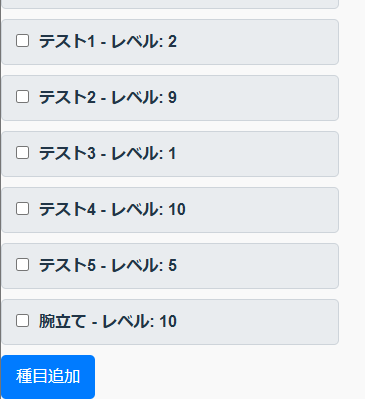
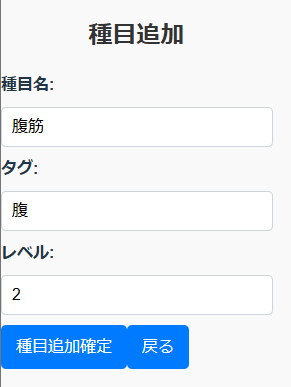

# アプリの概要

- 筋トレの種目とメニューを管理するためのアプリです。
- 種目を追加したり、メニューをチェックして管理することができます。

# 要件

- 筋トレメニュー管理画面にアクセスできること。
  - 筋トレメニューは DB 上のデータが参照され表示されていること。
  - DB 上にデータを追加できること。
- 筋トレメニュー管理画面では、各メニューにチェックが入れられること。

# 環境構築

## バックエンドの環境構築

- `cd backend`
- `npm i`

- `createdb muscle_app`を実行して DB 作成
- `npm run migrate`を実行してテーブル作成
- `npm run seed`を実行して初期データ作成

- `env.local`を作成(DB への接続情報を記入)
- `npm start`でバックエンドを起動

## フロントエンドの環境構築

- `cd frontend`
- `npm i`

- `env.local`を作成(「VITE_API_BASE_URL=/api」と記入)

- `npm run dev`でフロントエンドを起動

# 画面イメージ

- 筋トレメニューの表示

  

- 種目追加画面への遷移ボタン

  

- 種目追加画面

  

# 将来の計画

- 部位別での表示機能
- メニューの並べ替え機能
- DB に保存したメニューの削除機能
- カレンダー+過去にこなしたメニューの記録機能
- トレーニング日記機能
